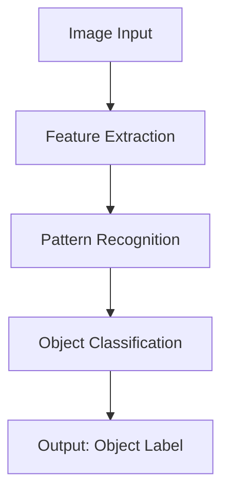

# Part I: Foundations of Intelligence

***

## Chapter 1: Perception - How Intelligence Gathers Information

Perception is the foundation of all intelligent behavior. Whether it's a human recognizing a friend's face or an AI system identifying objects in an image, perception is the process by which intelligent systems gather information about their environment.

***

### 1.1 Human Perception

Human perception is remarkably robust and adaptable. We can recognize faces in poor lighting, understand speech in noisy environments, and navigate complex spaces with ease. This is possible because our perceptual systems have evolved over millions of years to handle the challenges of survival.

#### The Multi-Sensory Nature of Human Perception

Humans perceive the world through multiple senses simultaneously:

- **Vision**: Processing light to understand spatial relationships
- **Audition**: Understanding sound patterns and spatial audio cues
- **Touch**: Feeling textures, temperatures, and pressures
- **Smell and Taste**: Chemical sensing for safety and nutrition
- **Proprioception**: Awareness of body position and movement

<ExpandableSection title="How does human perception differ from AI perception?">

  While AI systems typically process one modality at a time (e.g., computer vision for images, NLP for text), humans seamlessly integrate information from multiple senses. This multi-sensory integration allows humans to form more robust and reliable perceptions of their environment.

</ExpandableSection>

### 1.2 AI Perception

AI perception systems, while impressive in their own right, approach perception differently than humans. They typically rely on:

- **Pattern Recognition**: Identifying statistical regularities in data
- **Feature Extraction**: Breaking down complex inputs into manageable components
- **Statistical Modeling**: Using probability to handle uncertainty

#### Computer Vision Example

Modern computer vision systems can identify objects with remarkable accuracy, often exceeding human performance on specific tasks. However, they can also be fooled by adversarial examples that humans would never mistake.

:::tip
AI perception systems excel at processing large volumes of data quickly, but may lack the contextual understanding and adaptability of human perception.
:::

### 1.3 Perception-Action Loops

Both human and AI intelligence involve perception-action loops, where perception informs action, and action changes the perceptual input. Understanding these loops is crucial to understanding intelligence as a whole.

***

## Chapter 2: Reasoning - How Intelligence Processes Information

Reasoning is the cognitive process by which intelligent systems draw conclusions, make inferences, and solve problems. It's the bridge between perception and action, allowing intelligence to make sense of perceived information and determine appropriate responses.

***

### 2.1 Human Reasoning

Human reasoning is characterized by several key features:

- **Intuitive Reasoning**: Fast, automatic judgments based on pattern recognition
- **Analytical Reasoning**: Slow, deliberate processing of logical relationships
- **Analogical Reasoning**: Drawing parallels between similar situations
- **Causal Reasoning**: Understanding cause-and-effect relationships

<ExpandableSection title="How do humans balance speed and accuracy in reasoning?">

  Humans often use "fast thinking" (System 1) for routine tasks and "slow thinking" (System 2) for complex problems. This allows for efficient processing while reserving cognitive resources for important decisions.

</ExpandableSection>

### 2.2 AI Reasoning

AI reasoning systems approach these tasks differently, typically using:

- **Logical Inference**: Drawing conclusions from formal logical rules
- **Probabilistic Reasoning**: Handling uncertainty using probability theory
- **Neural Networks**: Learning patterns and relationships from data
- **Symbolic AI**: Manipulating symbols according to predefined rules

#### The Strengths of AI Reasoning

AI systems excel at:

- Processing vast amounts of information quickly
- Maintaining consistency across many decisions
- Following logical rules without emotional bias
- Identifying patterns that humans might miss

#### The Limitations of AI Reasoning

However, AI reasoning also faces challenges:

- Difficulty with common-sense reasoning
- Limited ability to understand context and nuance
- Challenges with abstract or creative thinking
- Vulnerability to adversarial inputs

### 2.3 Reasoning-Action Loops

Like perception, reasoning is part of a larger loop with action. Intelligent systems use reasoning to:

1. Interpret perceptual input
2. Consider possible actions
3. Predict the outcomes of actions
4. Select the most appropriate action
5. Execute the action and perceive the results

:::caution
Both human and AI reasoning can be affected by incomplete or misleading information, highlighting the importance of reliable perception.
:::

### 2.4 The Future of Reasoning Systems

As AI systems become more sophisticated, researchers are working to combine the best aspects of human and artificial reasoning, creating hybrid systems that leverage the speed and consistency of AI with the flexibility and contextual understanding of human reasoning.

***

# Part II: Embodied Intelligence

## Chapter 3: Physical AI & Humanoids - Intelligence in the Physical World

Physical AI represents a paradigm shift in artificial intelligence, moving beyond purely digital systems to create intelligent agents that interact with the physical world. This chapter explores the principles, design considerations, and future implications of embodied artificial intelligence.

***

### 3.1 Introduction to Physical AI

Physical AI encompasses intelligent systems that are physically embodied and interact with the real world. Unlike traditional AI that operates in virtual environments, Physical AI systems must navigate the complexities of real-world physics, sensory uncertainty, and embodied action.

Key characteristics of Physical AI include:
- **Embodied cognition**: Intelligence that emerges from the interaction between an agent and its environment
- **Real-world constraints**: Operating within the bounds of physics and real-time requirements
- **Multi-modal sensing**: Integrating information from various sensory modalities
- **Safe interaction**: Ensuring safe and predictable behavior around humans

### 3.2 Humanoid Design Principles

Humanoid robots are designed to operate in human-designed environments and interact naturally with humans. Key design principles include:

- **Human-centered compatibility**: Operating in human spaces without requiring modifications
- **Functional biomimicry**: Replicating human capabilities like bipedal locomotion and dexterous manipulation
- **Social intelligence**: Communicating and interacting using human-like behaviors
- **Safety considerations**: Ensuring safe operation around humans

### 3.3 Sensorimotor Integration

The foundation of Physical AI lies in sensorimotor integration - the continuous cycle of perceiving the environment and executing appropriate actions. This includes:

- **Real-time processing**: Handling sensory information with minimal latency
- **Motor control**: Coordinating complex movements across multiple actuators
- **Adaptive behavior**: Adjusting actions based on environmental feedback
- **Learning mechanisms**: Improving performance through experience

### 3.4 Human-Robot Interaction

Effective human-robot interaction is crucial for Physical AI systems:

- **Multimodal communication**: Using verbal and non-verbal cues for interaction
- **Social norms**: Following culturally appropriate interaction patterns
- **Trust building**: Establishing and maintaining human confidence in robotic systems
- **Collaborative autonomy**: Working alongside humans as partners rather than tools

### 3.5 Ethics and Future Implications

As Physical AI systems become more sophisticated, ethical considerations become paramount:

- **Safety and risk management**: Ensuring systems do not cause harm to humans or property
- **Privacy and surveillance**: Managing data collection and protection
- **Social impact**: Understanding the effects on employment and social structures
- **Responsible development**: Creating systems that enhance human flourishing

:::tip
Physical AI systems combine multiple AI techniques - computer vision for perception, reinforcement learning for control, and classical planning for high-level decision making - to create truly embodied intelligent agents.
:::

### 3.6 The Path Forward

Physical AI represents a convergence of robotics, machine learning, and cognitive science. As these systems become more sophisticated, they promise to revolutionize industries and enhance human capabilities in unprecedented ways. The future will require continued focus on safety, ethics, and human-centered design to ensure these powerful technologies benefit humanity.

The next sections will explore specific aspects of Physical AI, from technical implementation to real-world applications and societal considerations.