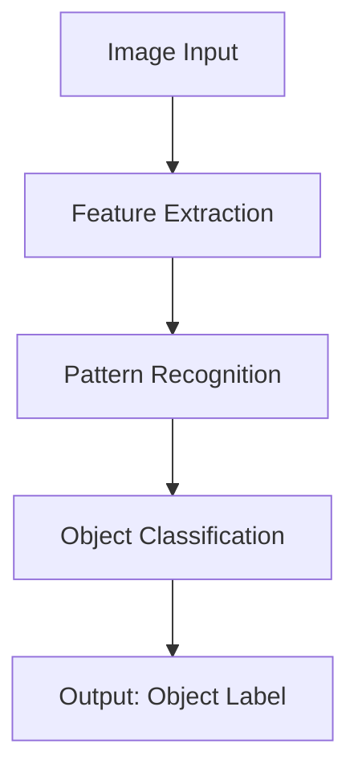

# Perception: How Intelligence Gathers Information

Perception is the foundation of all intelligent behavior. Whether it's a human recognizing a friend's face or an AI system identifying objects in an image, perception is the process by which intelligent systems gather information about their environment.

## Human Perception

Human perception is remarkably robust and adaptable. We can recognize faces in poor lighting, understand speech in noisy environments, and navigate complex spaces with ease. This is possible because our perceptual systems have evolved over millions of years to handle the challenges of survival.

### The Multi-Sensory Nature of Human Perception

Humans perceive the world through multiple senses simultaneously:

- **Vision**: Processing light to understand spatial relationships
- **Audition**: Understanding sound patterns and spatial audio cues
- **Touch**: Feeling textures, temperatures, and pressures
- **Smell and Taste**: Chemical sensing for safety and nutrition
- **Proprioception**: Awareness of body position and movement

<ExpandableSection title="How does human perception differ from AI perception?">

  While AI systems typically process one modality at a time (e.g., computer vision for images, NLP for text), humans seamlessly integrate information from multiple senses. This multi-sensory integration allows humans to form more robust and reliable perceptions of their environment.

</ExpandableSection>

## AI Perception

AI perception systems, while impressive in their own right, approach perception differently than humans. They typically rely on:

- **Pattern Recognition**: Identifying statistical regularities in data
- **Feature Extraction**: Breaking down complex inputs into manageable components
- **Statistical Modeling**: Using probability to handle uncertainty

### Computer Vision Example

Modern computer vision systems can identify objects with remarkable accuracy, often exceeding human performance on specific tasks. However, they can also be fooled by adversarial examples that humans would never mistake.

:::tip
AI perception systems excel at processing large volumes of data quickly, but may lack the contextual understanding and adaptability of human perception.
:::

## Perception-Action Loops

Both human and AI intelligence involve perception-action loops, where perception informs action, and action changes the perceptual input. Understanding these loops is crucial to understanding intelligence as a whole.